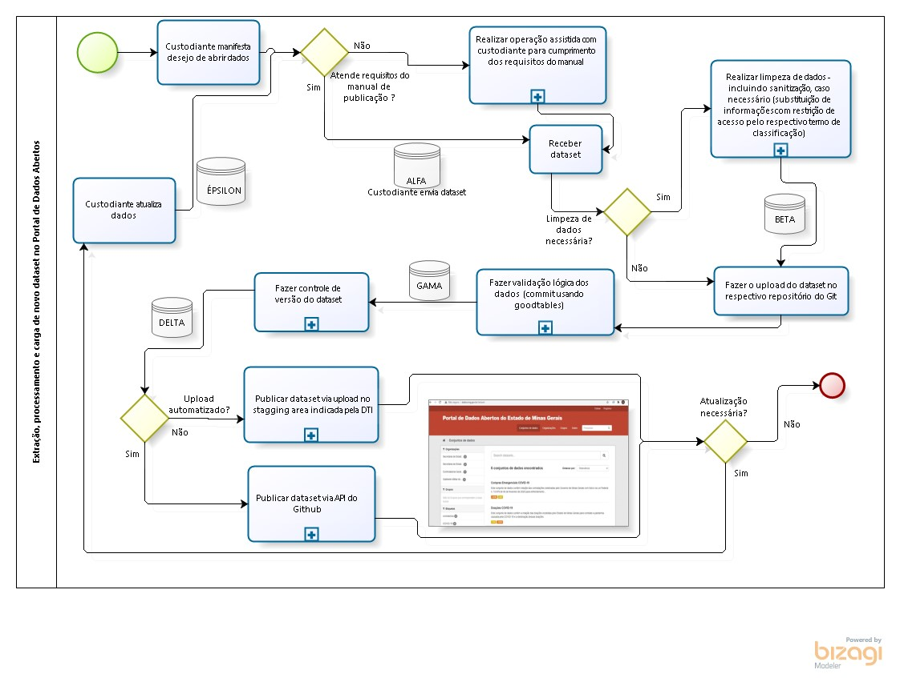
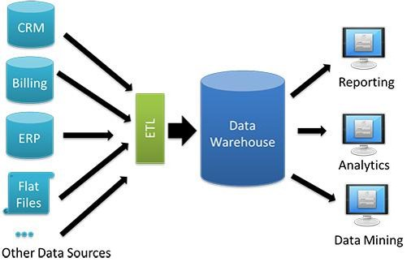
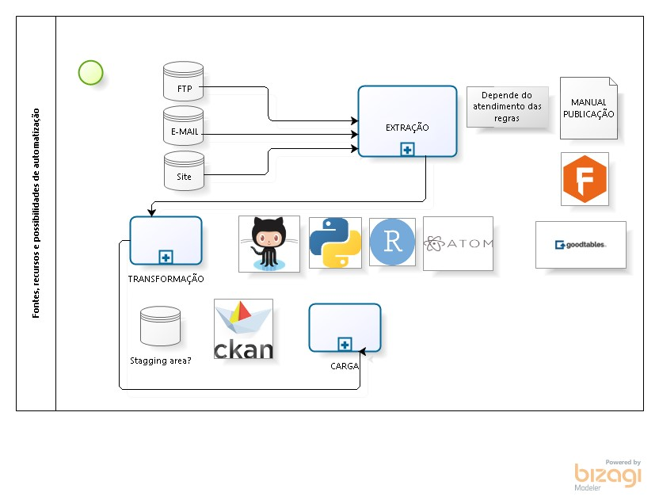
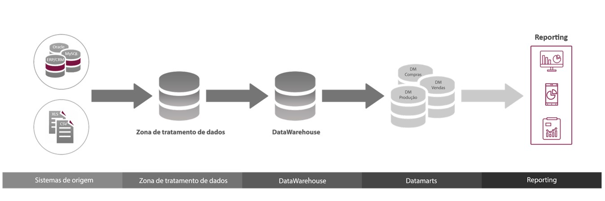

# Aspectos para decisão

## Atividades desenhadas para o mapeamento do processo com AEGRI X etapas gerais do fluxo de ETL:

	Mapeamento processo Assessoria Estratégica e de Gestão de Riscos Institucionais:

		1. Elaboração do Dicionário de dados
		
		2. Recepção do dataset
		
		3. Limpeza dos dados
		
		4. Sanitização (restrição infos classificadas)
		
		5. Validação lógica
		
		6. Controle de versão
		
		7. Publicação
	

	Fluxo ETl

		a. Extração: 1 e 2 (manual de publicação = especificações, convenções e normas sobre dados tabulares, Frictionless Data, Datapackage e validação lógica)

		b. Transformação: 3, 4, 5 e 6

		c. Carga: 7 (automatização a partir da API do Github ou inserção manual no FTP indicado pela DTI como stagging area)

## Data Warehouse e compliance do processo como um todo:

_"O objetivo do DW é centralizar todos os dados retirados de múltiplas fontes para facilitar a consulta. As informações podem ser extraídas de planilhas, sistemas legados, ERP’s, CRM’s, bancos de dados, e muitas outras."_ (Trecho de slide do módulo 3 do curso Publicadores da OKBR)

* pergunta: qual seria o data warehouse em qualquer das hipóteses de fluxo de ETL (com ou sem automatização)? 

## Possibilidades de automatização:

## Dificuldades técnicas sobre automatização do repositório do git ser usado como stagging area: 

	necessidade da DTI de uso de um FTP

